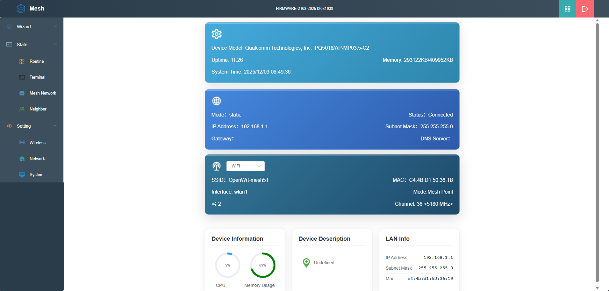
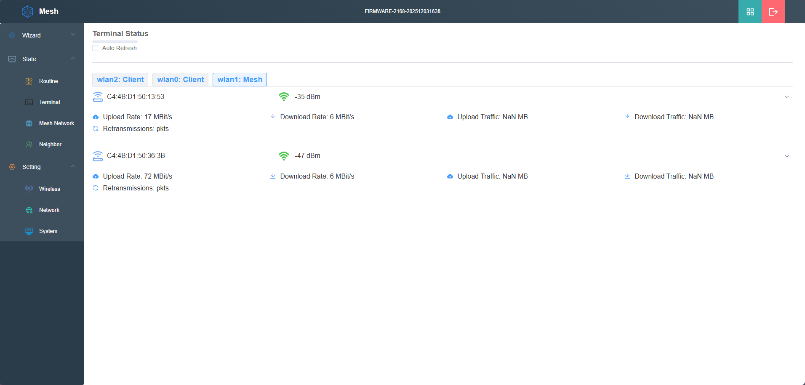
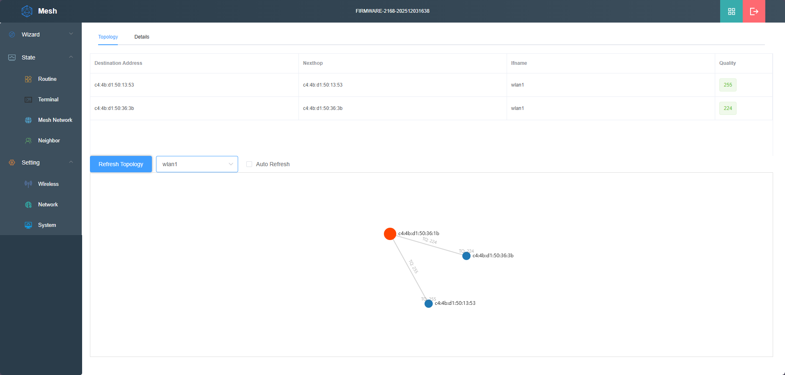
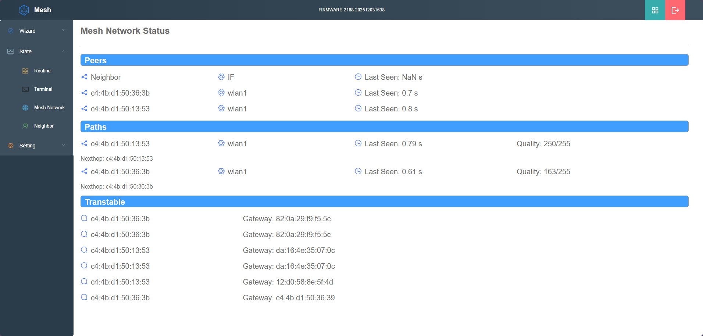
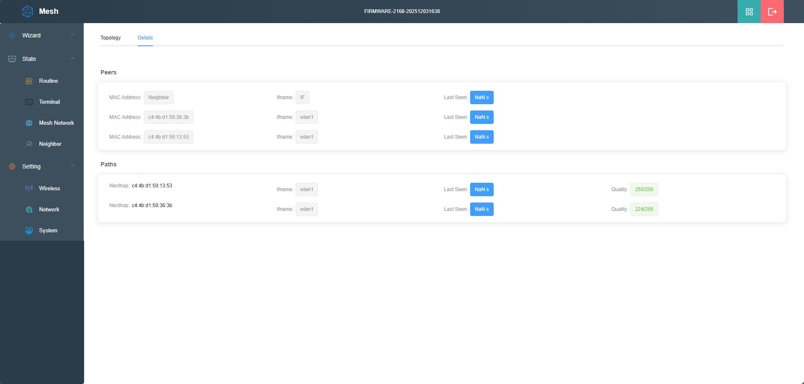

# OpenWRT IPQ5018 Mesh Project

**(If you are interested, please contact us at: jason@wallystech.com)**

Visit our [official website](https://www.wallystech.com/) for more information.

## 📋 Project Overview

This project is a customized compilation environment based on the **OpenWRT system**, specifically optimized for boards equipped with the **Qualcomm IPQ5018 chip**. The core features of the project are:

*   **Hardware Platform**: Qualcomm IPQ5018 high-performance SoC
*   **Network Protocol**: Integrated Mesh network functionality with B.A.T.M.A.N. (Better Approach To Mobile Ad-hoc Networking) protocol support
*   **Performance Optimization**: NSS (Network Subsystem) hardware acceleration support
*   **System Features**: Custom-compiled OpenWRT firmware, specifically optimized for Mesh networks

## 🚀 Key Features

### 1. **IPQ5018 Chip Optimization**
   *   Deep optimization specifically for the Qualcomm IPQ5018 chip
   *   Full utilization of dual-core ARM Cortex-A53 performance
   *   Integrated Wi-Fi 6 (802.11ax) support

### 2. **Mesh Network Integration**
   *   Complete Mesh network support
   *   Self-organizing network capability
   *   Multi-hop routing optimization

### 3. **B.A.T.M.A.N. Protocol**
   *   Advanced mobile ad-hoc networking protocol
   *   Distributed routing decisions
   *   Dynamic network topology adaptation

### 4. **NSS Hardware Acceleration**
   *   Network Subsystem hardware acceleration
   *   Enhanced network forwarding performance
   *   Reduced CPU load

## 📸 System Interface Display

### System Status Panel

*Figure 1: Overall system status including device information, network configuration, and performance monitoring*

### Mesh Network Overview

*Figure 2: Mesh network overall status display, including terminal status, network rates, and connection information*

### Mesh Network Topology

*Figure 3: Mesh network topology structure showing connection relationships and quality metrics between devices*

### Mesh Peer Node Status

*Figures 4 & 5: Mesh network peer node status showing neighbor discovery and path information*

## 🔧 Technical Specifications

### [Hardware Specifications](https://www.wallystech.com/WiFi6_product/DR5018S-wifi6-IPQ5018-2.4G-5G-6G-triband-11ax-MU-MIMO-OFDMA-QCN6122-QCN6102.html)
*   **Chip**: Qualcomm IPQ5018
*   **CPU**: Dual-core ARM Cortex-A53 @ 1.0GHz
*   **Memory**: 512MB DDR3L System Memory
*   **Storage**: 8MB NOR Flash, 128MB NAND Flash
*   **Wi-Fi**: 2.4GHz & 5GHz dual-band, supporting 802.11ax
*   **Network Interfaces**: 2 Gigabit Ethernet ports

### Software Specifications
*   **Operating System**: Customized OpenWRT version
*   **Mesh Protocol**: B.A.T.M.A.N. Advanced
*   **Network Acceleration**: NSS hardware acceleration
*   **Web Interface**: Customized LuCI interface
*   **Management Methods**: SSH, Web, Serial port

## 🛠️ Quick Start

### Compilation Method
1.  Run `./scripts/feeds update -a` to obtain all the latest package definitions defined in feeds.conf / feeds.conf.default.
2.  Run `./scripts/feeds install -a` to install symlinks for all obtained packages into package/feeds/.
3.  Run `make V=99` (The .config file has been placed in the root directory; there is no need to use `make menuconfig` for selection).

